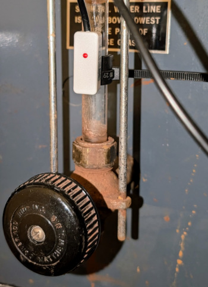
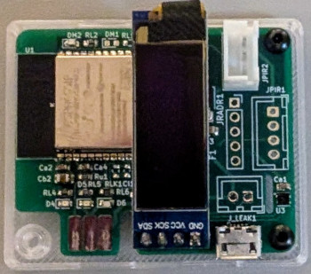
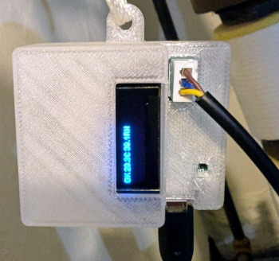

## Boiler133

This is software for monitoring the water level of a boiler, using a PCBA based on an ESP32. It is based on the [og3](https://github.com/chl33/og3) C++ framework.  The PCBA and project box are shared with the [Room133](https://github.com/chl33/Room133) box.

This uses the [Taidacent Non Contact Water Level Sensor](https://www.amazon.com/gp/product/B07FC8K28F) on the gauge class of the boiler to detect when the water level in a boiler needs to be refilled.

This is the board used for running the boiler software, which is in the Room133 project.

This is what the device looks like in its 3D printed project box.

