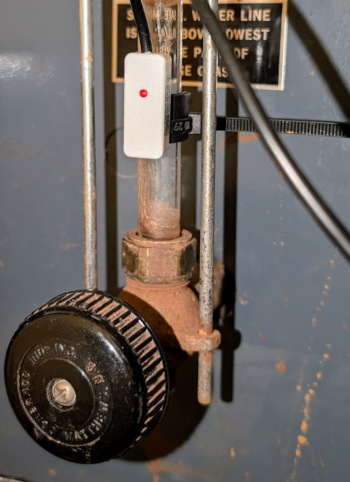
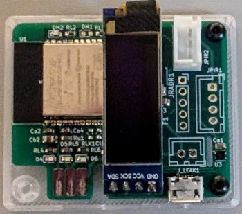
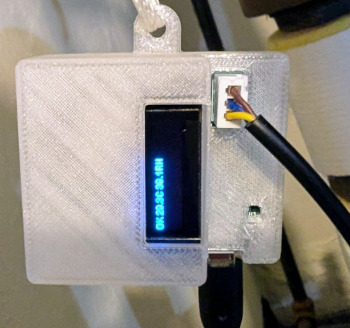

# Boiler133


Has your boiler ever shut down because it ran out of water?
This is software for monitoring the water level of a boiler, using a PCBA based
 on an ESP32.
It is based on the [og3](https://github.com/chl33/og3) C++ framework.
The PCBA and project box are shared with the
 [Room133](https://github.com/chl33/Room133) box.

See the Room133 [blog post](https://selectiveappeal.org/posts/room133/).

## Features

*   **Water Level Monitoring:** Uses a non-contact sensor to detect if the boiler needs refilling.
*   **Environmental Monitoring:** Measures Temperature and Humidity using an SHTC3 sensor.
*   **Home Assistant Integration:** Automatically discovers devices in Home Assistant via MQTT.
*   **Local Display:** Shows status (Water OK/Empty, Temp, Humidity) on an OLED screen.
*   **Web Interface:** Built-in web server for viewing status and configuring WiFi/MQTT settings.
*   **OTA Updates:** Supports Over-The-Air firmware updates.

## Hardware

*   **Board:** ESP32 (NodeMCU-32S compatible)
*   **Sensors:**
    *   [Taidacent Non Contact Water Level Sensor](https://www.amazon.com/gp/product/B07FC8K28F) (Connected to GPIO 23)
    *   SHTC3 Temperature & Humidity Sensor (I2C)
*   **Display:** SSD1306 OLED Display (I2C)
*   **LEDs:**
    *   Red: GPIO 18
    *   Yellow: GPIO 19
    *   Blue: GPIO 20



This is the board used for running the boiler software, which is in the Room133 project.



This is what the device looks like in its 3D printed project box.



## Getting Started

### Prerequisites

*   [PlatformIO](https://platformio.org/) (VSCode extension or CLI)

### Configuration

1.  Clone the repository.
2.  Copy `secrets.ini.example` to `secrets.ini`.
3.  Edit `secrets.ini` to provide your configuration:
    ```ini
    [secrets]
    udpLogTarget = <Your UDP Log Host IP>
    otaPassword = <Your OTA Password>
    ```

### Build and Upload

Run the following command to build and upload the firmware:

```bash
pio run -t upload
```

To monitor the serial output:

```bash
pio device monitor
```
